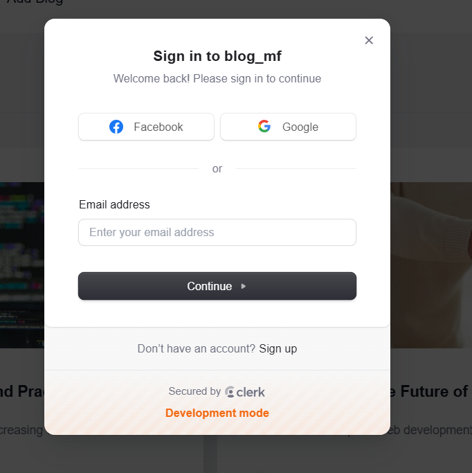

# Microfrontend Blog

A comprehensive blogging platform built using the **Microfrontend architecture**. This project demonstrates how to build scalable and modular applications by leveraging **React**, **Firebase**, **TailwindCSS**, **Clerk**, and **Module Federation**.

<p float="left">
  
  
  
  
</p>

<p float="left">
  
  
  
  
  
  
</p>

## Table of Contents

- [Microfrontend Blog](#microfrontend-blog)
  - [Table of Contents](#table-of-contents)
  - [Overview](#overview)
    - [Key Microfrontends:](#key-microfrontends)
  - [Features](#features)
  - [Technologies Used](#technologies-used)
  - [Project Structure](#project-structure)
    - [Folder Breakdown](#folder-breakdown)
  - [Installation and Setup](#installation-and-setup)
    - [Prerequisites](#prerequisites)
    - [Steps](#steps)
  - [Usage](#usage)
    - [Authentication](#authentication)
    - [Blog Management](#blog-management)
    - [Blog Viewing](#blog-viewing)
  - [Screenshots](#screenshots)
  - [MicroFrontend Screenshots](#microfrontend-screenshots)
  - [Contributing](#contributing)
  - [License](#license)

---

## Overview

The **Microfrontend Blog** project showcases the power of microfrontend architecture in creating modular and maintainable web applications. By breaking down the application into independently deployable microfrontends, we achieve:

- Better scalability
- Clear separation of concerns
- Improved developer productivity


### Key Microfrontends:

1. **Auth Microfrontend (`auth-mfe`)** - Handles user authentication.
2. **Dashboard Microfrontend (`dashboard-mfe`)** - Allows users to create, edit, and manage blogs.
3. **Viewer Microfrontend (`viewer-mfe`)** - Displays blogs and associated comments.
4. **Shared Components (`shared-components`)** - Houses reusable components shared across other microfrontends.
5. **Container (`container`)** - Serves as the entry point and orchestrates the integration of all microfrontends.

---

## Features

- **Authentication**: Secure login and signup using Firebase Authentication.
- **Blog Management**: Create, edit, and delete blogs from the dashboard.
- **View Blogs**: Seamless blog viewing experience with comments support.
- **Reusable Components**: Shared UI components across microfrontends.
- **Responsive Design**: Built with TailwindCSS for a consistent and mobile-friendly UI.

---

## Technologies Used

- **React**: Frontend library for building user interfaces.
- **Firebase**: Backend-as-a-Service for authentication and database.
- **TailwindCSS**: Utility-first CSS framework for styling.
- **Module Federation**: Webpack feature for microfrontend integration.
- **Webpack**: Module bundler for building the application.
- **Clerk**: User authentication library for React applications.

---

## Project Structure

```
./auth-mfe
./container
./dashboard-mfe
./viewer-mfe
./shared-components
```

### Folder Breakdown

- **auth-mfe**: Handles authentication logic.
- **container**: Acts as the host application.
- **dashboard-mfe**: Provides functionality for blog management.
- **viewer-mfe**: Renders blogs and their comments.
- **shared-components**: Contains reusable components.
- **docs**: Contains documentation images and diagrams.

---

## Installation and Setup

### Prerequisites

Ensure you have the following installed:

- Node.js (>= 16.x)
- npm (>= 7.x)

### Steps

1. Clone the repository:

   ```bash
   git clone https://github.com/ravikisha/microfrontend-blog.git
   cd microfrontend-blog
   ```

2. Install dependencies for each microfrontend:

   ```bash
   cd auth-mfe && npm install && cd ..
   cd container && npm install && cd ..
   cd dashboard-mfe && npm install && cd ..
   cd viewer-mfe && npm install && cd ..
   cd shared-components && npm install && cd ..
   ```

3. Start each microfrontend in development mode:

   ```bash
   cd auth-mfe && npm start
   cd container && npm start
   cd dashboard-mfe && npm start
   cd viewer-mfe && npm start
   cd shared-components && npm start
   ```

4. Open the application:

   Navigate to [http://localhost:3005](http://localhost:3005) in your browser.

---

## Usage

### Authentication
- Sign up or log in via the **Auth Microfrontend**.

### Blog Management
- Access the dashboard to create and manage blogs.

### Blog Viewing
- Explore blogs and add comments via the **Viewer Microfrontend**.

---

## Screenshots


1. **Home Page**:

   

2. **Login Page**:

   

3. **Create Blog**:

   

4. **View Blog**:

   
   


## MicroFrontend Screenshots

1. **Auth Microfrontend**:

   

2. **Dashboard Microfrontend**:
    
   

3. **Viewer Microfrontend**:
 
   

4. **Shared Components**:

   

5. **Container**:

   


---

## Contributing

Contributions are welcome! Follow these steps to contribute:

1. Fork the repository.
2. Create a new branch:

   ```bash
   git checkout -b feature-name
   ```

3. Commit your changes:

   ```bash
   git commit -m "Add feature-name"
   ```

4. Push the branch:

   ```bash
   git push origin feature-name
   ```

5. Open a Pull Request.

---

## License

This project is licensed under the MIT License. See the [LICENSE](./LICENSE) file for details.

